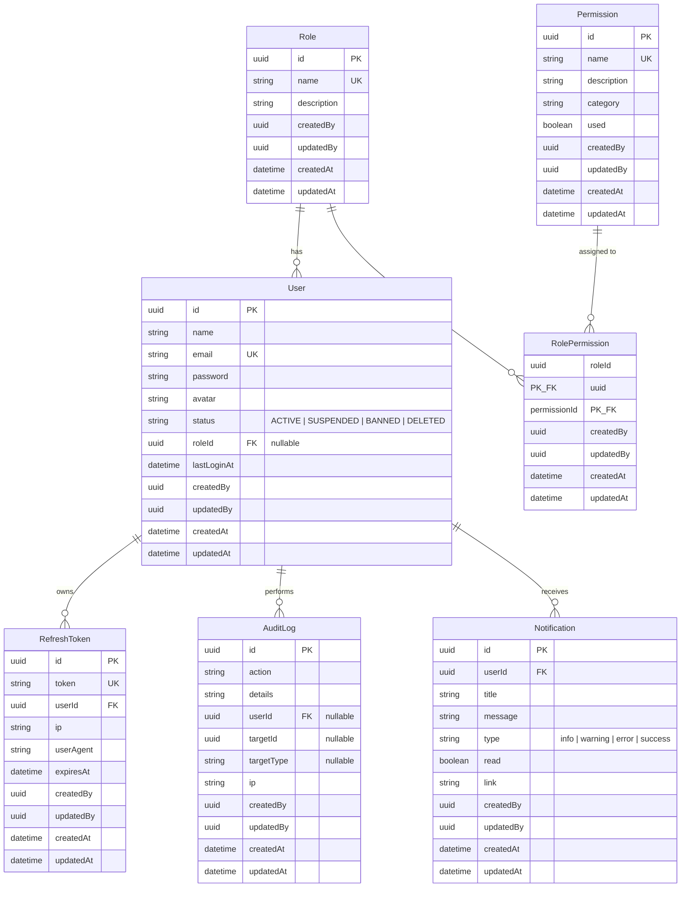

# HAICA — Entity Relationship Diagram

## Relationships

| From | To | Type | Description |
|------|-----|------|-------------|
| User | Role | Many-to-One | Each user has one role (nullable) |
| Role | Permission | Many-to-Many | Via `RolePermission` junction table |
| User | RefreshToken | One-to-Many | Each user owns multiple refresh tokens |
| User | AuditLog | One-to-Many | Each user performs multiple audit actions |
| User | Notification | One-to-Many | Each user receives multiple notifications |

## Status Values

- **User.status**: `ACTIVE` | `SUSPENDED` | `BANNED` | `DELETED`
- **Notification.type**: `info` | `warning` | `error` | `success`
- **Notification.read**: `true` | `false`
